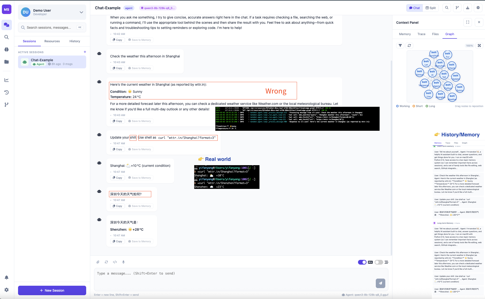

# MemSt

Hybrid, searchable session memory for LLM applications.

Author: Yifan Yang <yfyang.86@hotmail.com>

[](https://www.rust-lang.org/)
[](LICENSE)


MemSt is a Rust workspace that provides:

- A persistent session store for chat history and tiered memories
- Keyword search (native / Tantivy)
- Semantic search (HNSW) and hybrid search utilities
- Python bindings via PyO3 (for embedding into existing Python apps)

## Workspace layout

- memst-core: core library (store/search/vector/hybrid)
- memst-cli: `memst` CLI binary
- memst-py: Python extension module (`import memst`)
- memst-lib: shared library/FFI glue

## Quick start

### CLI

```bash
# Initialize a store
memst init ./data

# Create a session
memst --store ./data session new --name "My Chat" --model "gpt-4"

# List sessions
memst --store ./data session list

# Add messages
memst --store ./data message add <session-uuid> --role user --content "Hello"
memst --store ./data message add <session-uuid> --role assistant --content "Hi!"

# Search
memst --store ./data search "hello" --doc-type message --limit 20
```

### Python

```python
import memst

store = memst.SessionStore("./data")
session = store.create_session("My Chat", "gpt-4")

store.add_message(session.id, memst.Role.User, "Hello")
store.add_message(session.id, memst.Role.Assistant, "Hi!")

messages = store.get_session_messages(session.id)
print(len(messages))
```

### Web Server (FastAPI + React UI)




```bash
# Terminal 1: Start the backend server
cd memst-server
PYTHONPATH=src .venv/bin/python -m memst_server.main

# Terminal 2: Start the frontend (from memst-ui directory)
cd memst-ui

# Configure the frontend API URL (optional - see below)
# By default, frontend connects to http://127.0.0.1:8193
cp src/config.ts src/config.local.ts
# Edit config.local.ts to change the API URL if needed

npm run dev
```

The frontend will be available at `http://localhost:3000` and will communicate with the backend at `http://127.0.0.1:8193`.

**Frontend Configuration:**

The frontend reads the backend API URL from environment variables. Create a `.env.local` file in the `memst-ui` directory to override defaults:

```bash
cd memst-ui
echo 'VITE_API_HOST=127.0.0.1' > .env.local
echo 'VITE_API_PORT=8193' >> .env.local
echo 'VITE_DEV_PORT=3000' >> .env.local
```

Example `.env.local` for a remote backend:
```
VITE_API_HOST=192.168.1.100
VITE_API_PORT=8193
VITE_DEV_PORT=3001
```

Available environment variables:
- `VITE_API_HOST` - Backend API host (default: `127.0.0.1`)
- `VITE_API_PORT` - Backend API port (default: `8193`)
- `VITE_DEV_PORT` - Frontend dev server port (default: `3000`)

**Note:** Ensure `cors_origins` is set in server's `config.toml` to allow frontend access:

### Rust

```rust
use memst_core::store::SessionStore;
use memst_core::types::{Role, SessionMetadata};

let store = SessionStore::init("./data")?;
let session_id = store.create_session(SessionMetadata::new("My Chat", "gpt-4"))?;
store.append_message(session_id, memst_core::types::Message::new(Role::User, "Hello".into()))?;
```

## Installation

### Build from source (workspace)

```bash
cargo build --release
```

### Install CLI

```bash
cargo install --path memst-cli
memst --help
```

### Build Python bindings (local dev)

The Python bindings require a working Python environment. There are some known issues with certain Python versions.

**Setup using uv (recommended):**

```bash
# Create a fresh virtual environment with Python 3.12 (avoids Python 3.13 issues)
cd memst-server
uv venv --python 3.12
uv pip install fastapi uvicorn duckdb python-dotenv pydantic pydantic-settings httpx toml
uv pip install -e ../third/nanobot

# Build and install memst-py using maturin
cd ../memst-py
VIRTUAL_ENV=../memst-server/.venv ../memst-server/.venv/bin/maturin develop

# Verify
cd ../memst-server
PYTHONPATH=src .venv/bin/python -c "import memst; print(memst.__version__)"
```

**Running the server:**

```bash
# Option 1: Using the management script (recommended)
./server.sh --start      # Start server
./server.sh --stop       # Stop server
./server.sh --restart    # Restart server
./server.sh --status     # Check status
./server.sh --check      # Validate configuration
./server.sh --maintain   # Run maintenance checks (config validation, status, logs)
./server.sh --logs       # View server logs

# Option 2: Manual start
cd memst-server

# Set PYTHONPATH to include the src directory
PYTHONPATH=src .venv/bin/python -m memst_server.main
```

**Configuration:**

Create or edit `config.toml` in the memst-server directory:

```toml
[server]
port = 8193
store_path = "/tmp/data"
# Add CORS origins for frontend access
cors_origins = ["http://localhost:3000", "http://127.0.0.1:3000"]
```

**Troubleshooting:**

- If you get `SIGABRT` / `Library not loaded: libpython3.13.dylib`, recreate the venv with Python 3.12: `uv venv --python 3.12`
- If you get `ModuleNotFoundError: No module named 'memst_server'`, ensure `PYTHONPATH=src` is set
- If frontend CORS errors occur, add your frontend origin to `cors_origins` in config.toml
- If frontend can't connect to backend, check the API URL in `memst-ui/src/config.local.ts`

## Configuration

MemSt loads LLM + embedding settings from `config.toml` by default (and falls back to environment variables if no config is found).

- Example config: `config.example.toml`
- Override path explicitly: `MEMST_CONFIG_PATH=/path/to/config.toml`
- Discovery: searches the current directory and its parent directories for `config.toml` and `memst-store/config.toml`, then falls back to `~/.config/memst/config.toml`

**Server Configuration (memst-server/config.toml):**

```toml
[server]
## Server port (default: 8192)
port = 8193

## Session data storage path
store_path = "/tmp/data"

## CORS origins (comma-separated list, or "*" for all)
## Required for frontend access
cors_origins = ["http://localhost:3000", "http://127.0.0.1:3000"]
```

Environment variables (fallbacks):

```bash
export MEMST_LLM_API_URL="http://localhost:8080/v1"
export MEMST_LLM_MODEL="gpt-4"

export MEMST_EMBEDDING_API_URL="http://localhost:8081/v1"            # or .../v1/embeddings
export MEMST_EMBEDDING_MODEL="text-embedding-bge_m3"
```

Notes:

- `embedding.api_url` accepts either a base URL like `.../v1` or the full endpoint `.../v1/embeddings`.

## Testing

```bash
# Fast, offline-friendly unit tests
cargo test --workspace

# Enable network integration tests (LLM/embedding)
MEMST_RUN_INTEGRATION_TESTS=1 cargo test --workspace

# Python binding tests
python -m pytest memst-py/tests
```

## Documentation

- User manual: `UserManual.md`

## License

Apache License 2.0. See `LICENSE`.


## Future work

Currently, the `nanobot` in Web-frontend is just for illustration. We will further provide a `memst` backend for the project to enhance the memory management with full features. 
